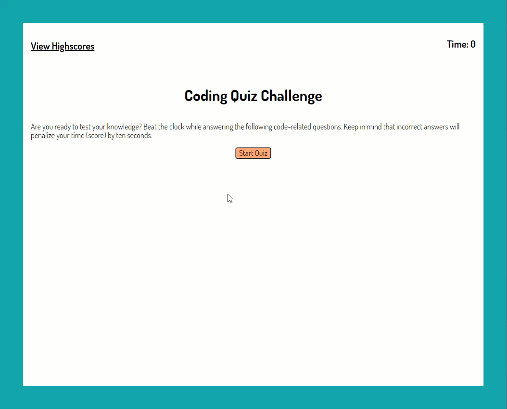

# coding-quiz
## Description
A simple application that will test the user's coding knowledge through a series of timed multiple choice questions (MCQ). At the end of the quiz, the user has the option to record their highscore to the leaderboard by providing their initials. The questions cover the topics of HTML, CSS and Javascript. The goal of this application was to demonstrate skills in Javascript, specifically dynamic updates to the DOM and handling events ('click', for example) from the HTML document.
## Usage
[Take the coding quiz here!](https://michaelhermes.github.io/coding-quiz/)

The user begins by clicking the "Start Quiz" button. This will start a 60-second timer and begin presenting MCQs.

After selecting an answer, the next MCQ will be shown and the user will be presented with feedback as to whether they answered the previous question correctly or incorrectly. An incorrect answer will deduct 10-seconds from the quiz timer.

Once all questions have been answered or the timer runs out, the user will see their final score and have the option to enter their initials to track their highscore on the leaderboard.

